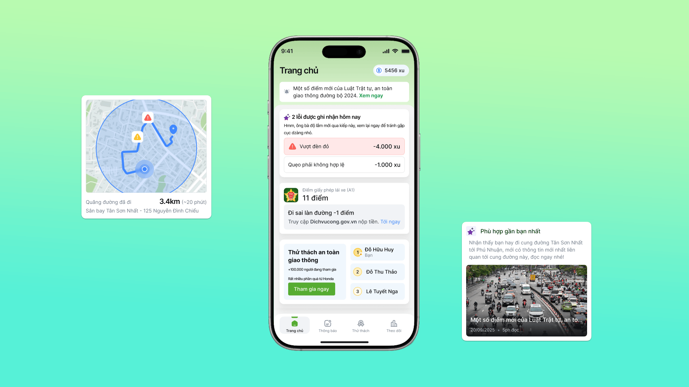
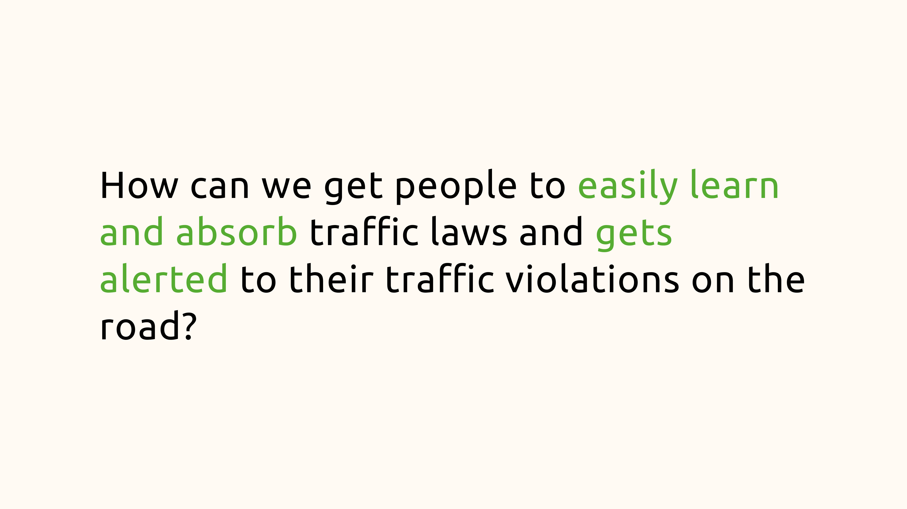
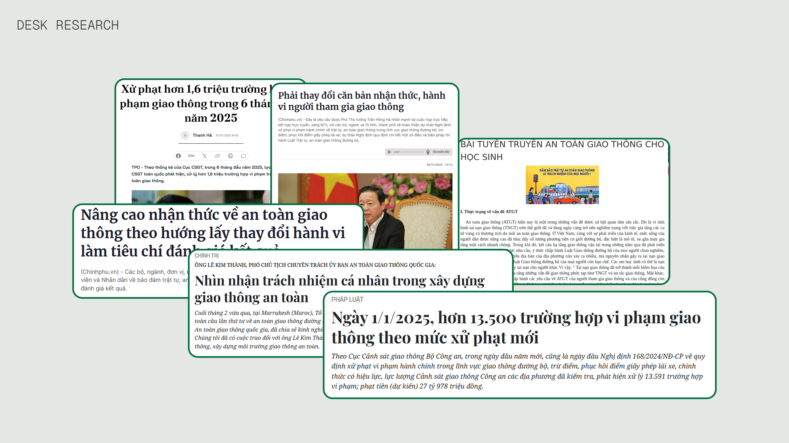
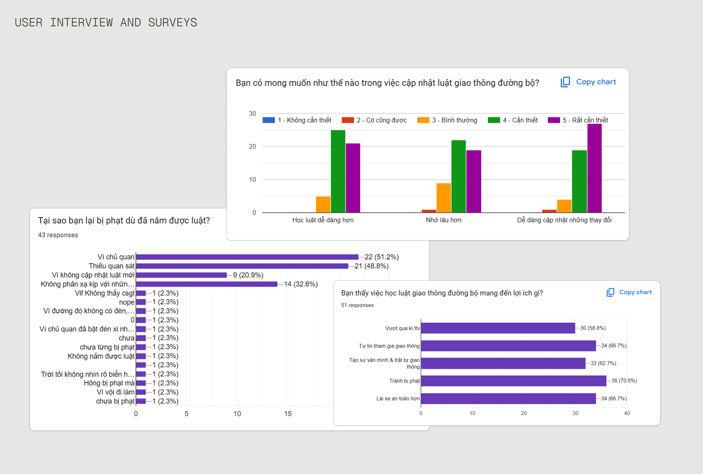
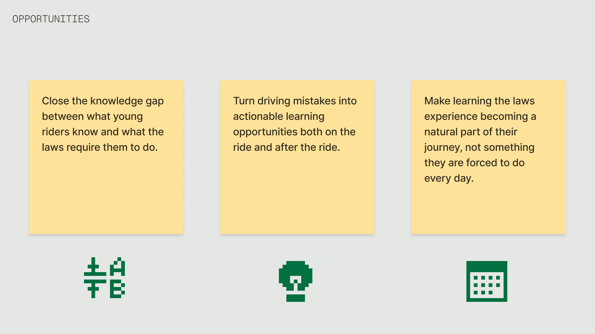
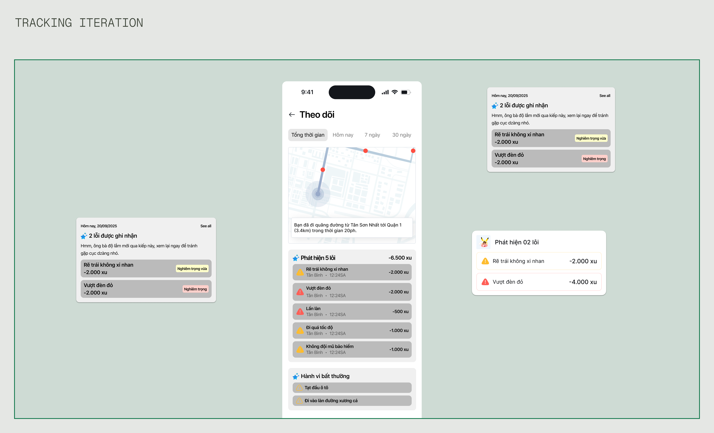
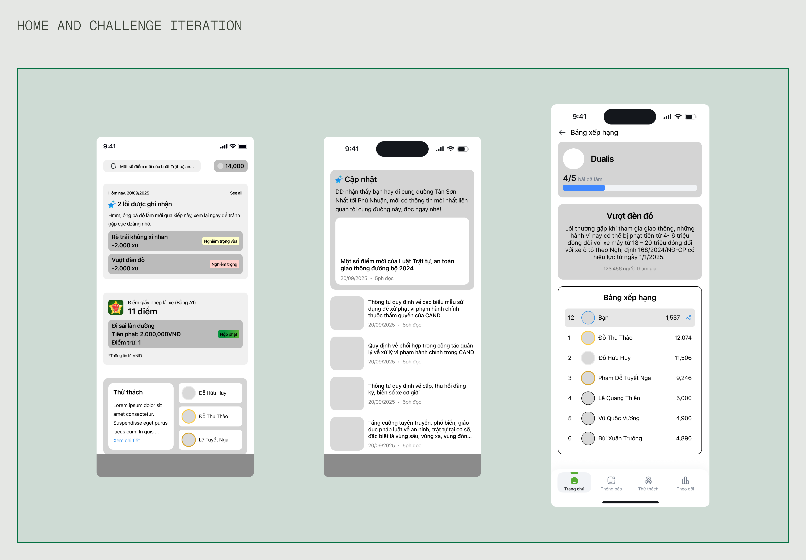
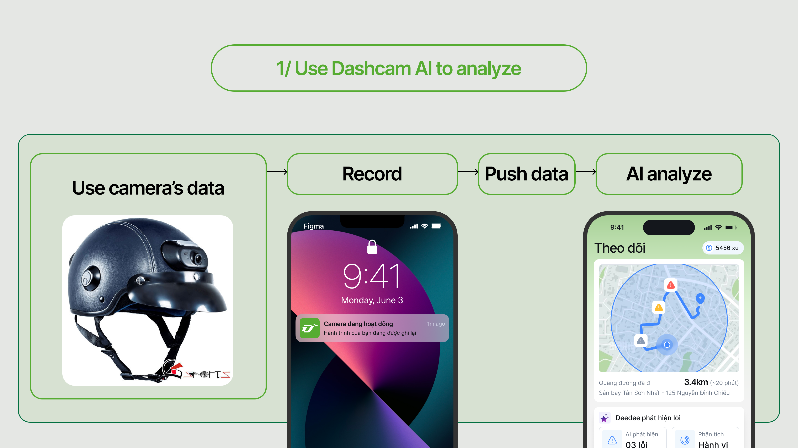
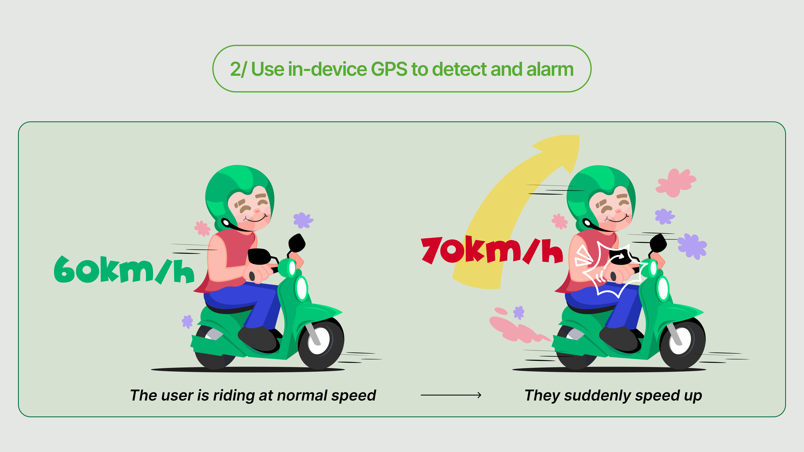
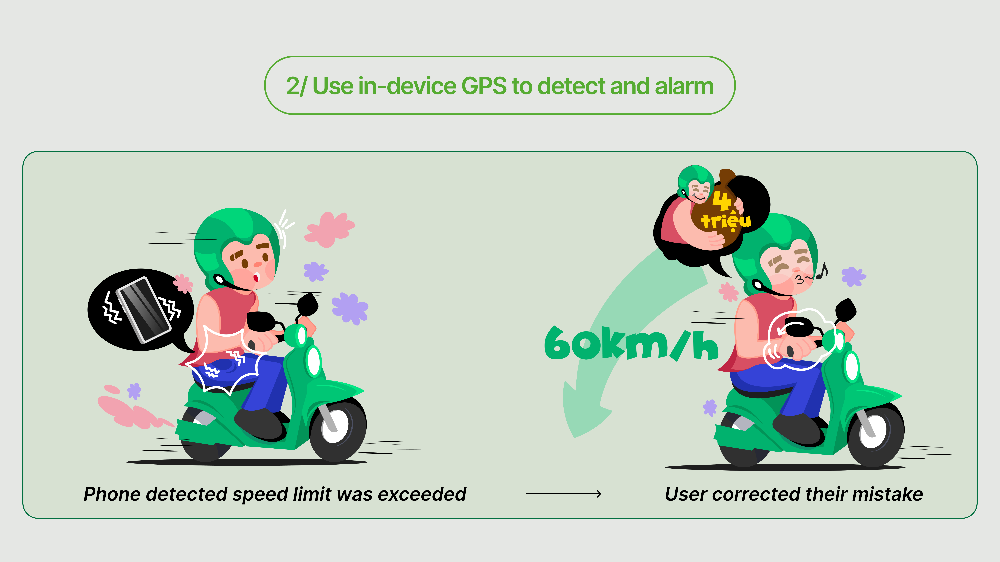



## Overview

In September 2025, I had privilege to join one of the most famous competition in Product Design field of Vietnam: Lollypop Designathon. Designathon is a unique event where teams match against each other in a 24hr race to research and deliver their solution matched with the given subject of the game.
## Problem Space

None of us wants to make mistake when we are riding motorbikes on the road. If we accidentally do and got caught, that means we will get fined heavily, our driver license might get revoked or worse, our motorbike will be temporarily held by the police.

However, most young people have trouble when navigating in the traffic. It's not because they don't care about the road laws, it's that those laws are so confusing and hard to remember for most of them that for them, every time they get on the road is like a losing battle.

The government imposed stricter laws, hoping they will reduce the number of traffic violation cases, which in fact can make the issue even worse. Because when riders feel cornered and overwhelmed, some of them will switch to "defensive" stance, tuning out the rules entirely rather than following them genuinely.

Solutions were made to address this, however, most solutions fell short since they only provide on what laws there when we go on the road, and not the core issue of the problem: helping them understand those laws easily and know how to follow them.

## Tackling the Problem
This problem provided a huge opportunity to learn more about the huge gap between Vietnam's traffic regulations and its actual application to real life. And that's what we wanted to solve for.

## My Individual Contribution

1. I led my team planning and executing user research. 
   For quantitative research, we decided on conducting surveys to quickly gauge how widespread this problem was for young people. Alongside this, we also did qualitative research through short 15-minute interviews to dive deeper into how our respondents navigated the challenge of both going on the road and learning the laws themselves. With the way I led our team's research phase, we got a clearer picture of our waiting-to-be-solved problem at scale, and left us with deeper understanding of our user's pain.
2. I also led my team with content design structure. Doing content design early helped us explore our design direction before investing more time in visual design, saved us significant time during the UI phase. 

## User Research

My team surveyed over 50 respondents and conducted 5 interviews with high school and university students in Hanoi. We focused on how they currently learn about traffic regulations and what happens when they unknowingly break them. And these are the key insights my team and I synthesized:

 Their knowledge about traffic laws is outdated or can't keep up with new ones 
 Government teaching methods failed to engage students 
 They only learn new laws through word of mouth from parents or only through social media posts  

The issue is clear: young people ignored learning updated traffic regulations when government announcements are boring and failed to grab attention.

## Turn insights into opportunities

Guided by user research and online survey, we turned these three key pain points: outdated knowledge, uninteresting method when teaching updated regulations and only know new laws through words of mouth--- into corresponding opportunity goals for our designs.

1. Close the knowledge gap between what young riders know and what the laws require them to do.
2. Turn driving mistakes into actionable learning opportunities both on the ride and after the ride.
3. Make learning the laws experience becoming a natural part of their journey, not something they are forced to do every day.

## Creating the goals
Based on our user research, we started to define our core **user story** to guide our work:

**As a** motorcyclist participating in the traffic.

**I need to** understand the mistakes I've made on the road without thinking about them when I'm riding.

**So I can** learn from them after each ride to become a safer rider over time.

With that said, we defined **3** core user goals for our app:
1. Stay safe and aware while on the road without distractions.
2. Understand where I got wrong without the app interfering my ride.
3. Learn about traffic laws in a way that make sense in a way for me, without feeling I have to read an university textbook.

With our user goals defined, we translated them into business goals for our app:
1. Establish our app as the go-to learning app for young riders when learning about traffic laws.
2. Drive daily usage by making learning laws a habitual part of users' riding journey.
3. Reduce the number of users violated traffic laws by improving their knowledge of the laws.

## Ideation
After we sketched our preliminary lo-fis, we headed to create mid-fidelity wireframes to explore our options, build our vision of Dede.
### Tracking Iteration
Since tracking and reporting mistakes when driving or riding on the road is our most prominent feature, we dived in it first to quickly explore potential key functions which could be highlighted. These included a tracking map for the user's road journey, detailed reports based on the severity of the mistakes were made, as well as some short light-hearted punish sentence. 

While the initial screen conveyed most information, we ultimately decided to hide the detailed report and replace it with quick overview of numbers of mistakes. The reason is:

 Too much unnecessary information on screen 
 The severity of the problems weren't explained clearly to users 
 Users might confuse digital currency points in app as real money 

### Home and Challenge iteration
We prototyped home and challenge screens but ran out of time to fully iterate on them. With 12 hours until deadline, we had to choose: polish secondary screens or perfect our core tracking feature. We chose the latter, accepting that some screens are ultimately kept minimal. In a 24-hour sprint, we prioritized depth in our primary feature over polish across all screens. We were transparent about this in our presentation, positioning these as areas for future iteration.

## Assumptions & Constraints
Given the designathon timeline, we focused on designing the mobile experience and assumed certain technical capabilities would exist. In a real-world scenario, these would require significant research and validation:
##### Hardware Dependency
Our solution assumed a specialized camera exists and is affordable/accessible to our target users. We did not validate market readiness and manufacturing feasibility.
##### Camera Accuracy
We assumed AI could reliably analyze dash cam footage to identify traffic violations. The actual accuracy rate, edge cases, and training data requirements were outside our scope.
##### Privacy and Data Security
We did not design for data storage, user consent flows, or privacy policies. Privacy is a huge concern for real users when they interact with hardware that are capable of recording video footage, which would be critical for real implementation given the sensitive nature of location and video data.
##### Safety Concerns
Phone vibrations while riding may be distracting. Real-world testing would be needed to determine how much frequency, intensity and alert method is needed to alert riders without endangering them.

## Design Solution
Before heading out, the users only have to wear a specialized motorcycle helmet that's equipped a **small camera**. The camera is configured to **automatically record and send data** with wi-fi signals to Dede **mobile app**. When the user finished their journey and their phone is connected to Internet, Dede **push** those data to AI so the AI can **analyze** the user's journey and **produce** the analysis after an amount of time.

For the alarm part, the app will use phone's **readilly available GPS** sensors. The app will have the offline data of the current road the user riding on, send **vibrating** signals to notify the user if they **accidentally violated** the traffic regulations like **stepped over** the white line before the traffic lights or **exceeded** the speed limit within a threshold.

## Final Design
With the wireframes and low-fidelity mockups established, we transitioned to next phase to create high-fidelity mocks.


  
  


## Outcome
We had the once-in-a-lifetime opportunity to share the work we done with other designers in Ho Chi Minh City. Sadly we didn't gain any honorary reward at all but the senior designers gave us a lot of valuable feedbacks. I had the chance to demonstrate our work on the stage with hundreds of people watching our work unfold.

## What I learned
### Early validation matters - especially for hardware dependencies
Can our users afford it? How should we integrate our camera hardware into their daily life? Who will manufacture it? How should we market it and present it not only for our users but also for those who want to invest in it? For something that is as critical as hardware, early validation like cost interview, value preposition and market research should come before interface design - not after. 
### Design for failures, not just when it works
We designed screens showing "AI analysis results" without taking into consideration what happens when AI fails - misidentified a violation, extreme weather, poor lightning conditions like roads without lights at night. Real products need designed states for uncertainty, not just success cases.
### Privacy as priority, not an afterthought
Recording users' driving journeys with cameras felt like an obvious solution to our problem. Only after we presented our solution did we realize that the ultimate choice when using product lies in our users. Optional data collection, data deletion option, and consent flows are all equally important for the whole customer's journey. 