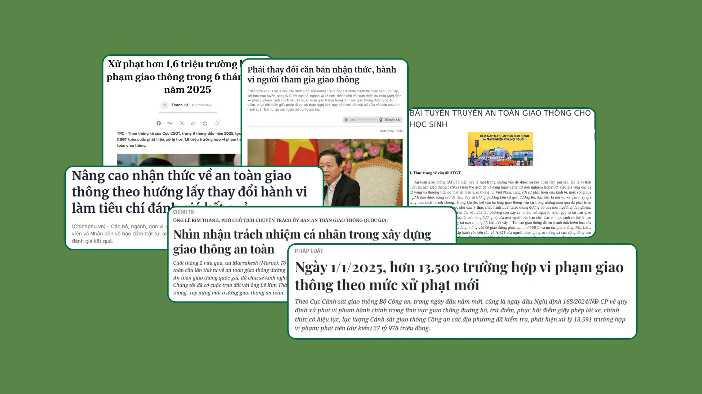
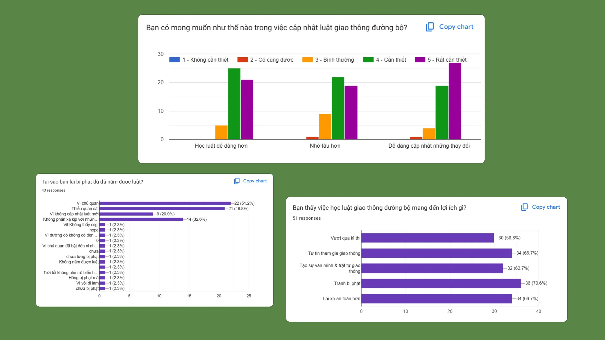
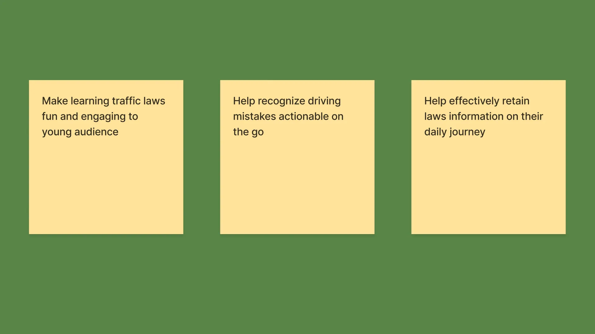
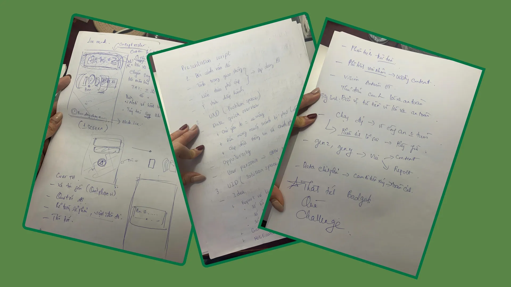
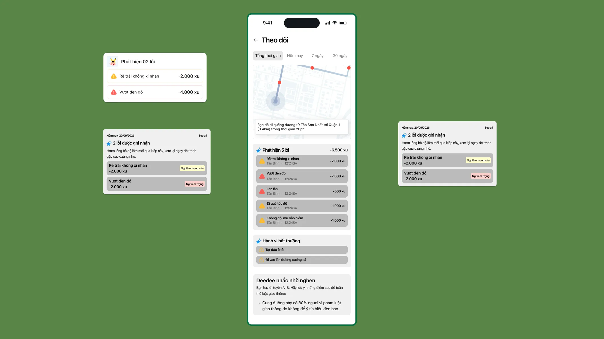
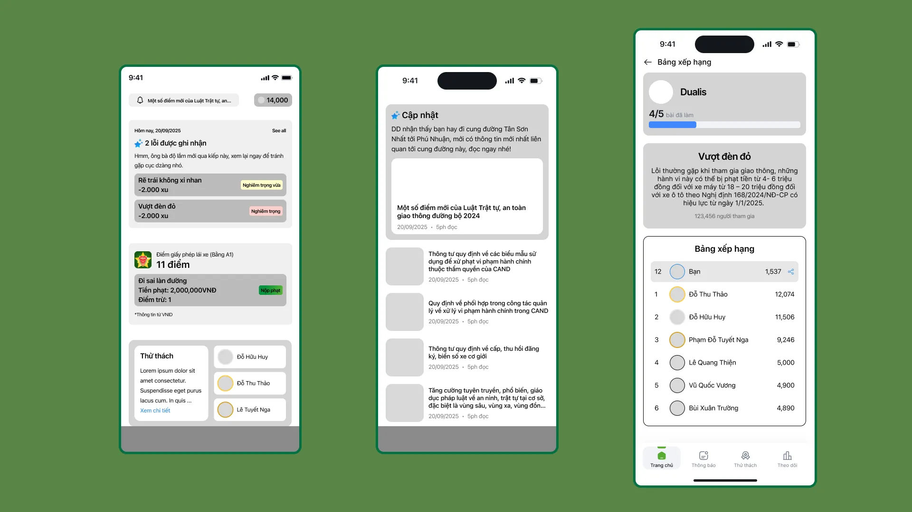
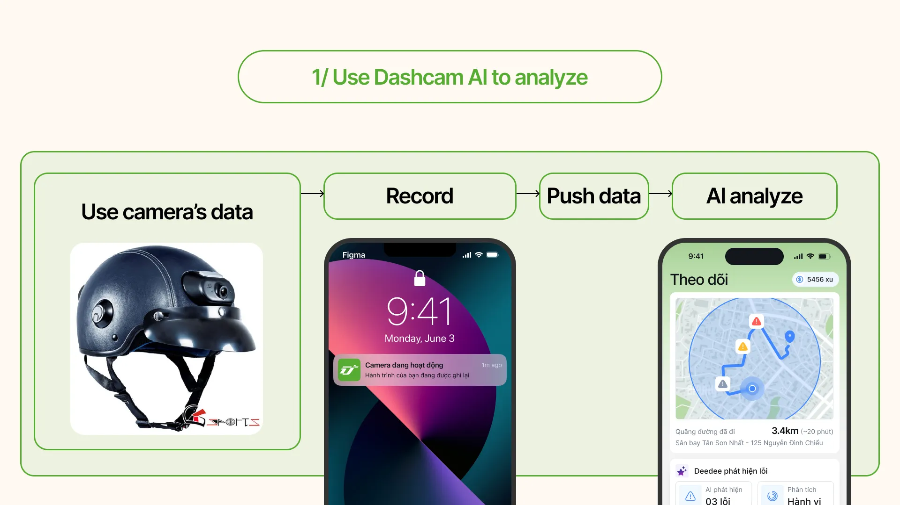
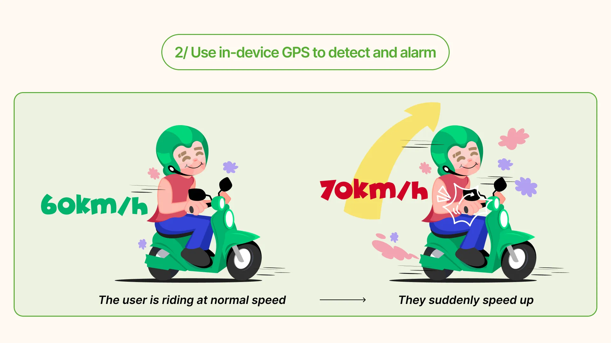
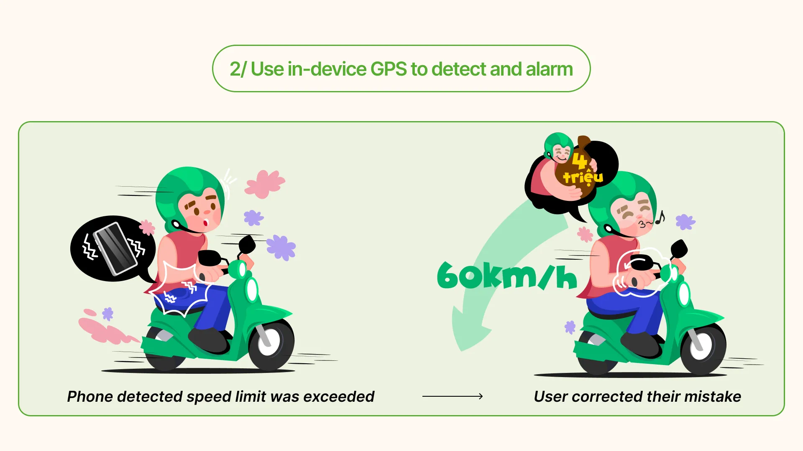
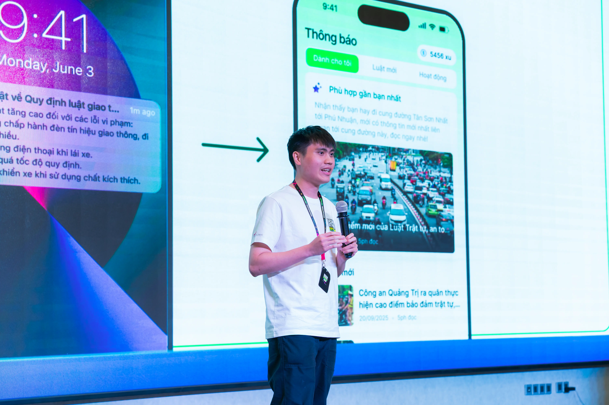



## Overview
In September 2026, I had privilege to join one of the most famous competition in Product Design field of Vietnam: Lollypop Designathon. Designathon is a unique event where teams match against each other in a 24hr race to research and deliver their solution matched with the given subject of the game.

## Problem Space
The daily traffics in big cities are often chaotic and unpredictable at times. There is virtually no product that can help people to know if they accidentally violate traffic regulations on the road. And for sure none wants to read those long boring news about updated traffic rules either.

This is also becoming a heavy burden on the government too. The government imposed stricter laws, hoping them will curb the traffic violation cases, but in turns created reinforcement loop for both of the parties.

## Tackling the Problem
This problem provided a huge opportunity to learn more about the huge gap between Vietnam's traffic regulations and its actual application to real life. And that's what we wanted to solve for.

## User Research

I and my team conducted survey and interviewed various high-school and colleague students to listen to their frustrations when participating in traffics. And these are the key insights my team and I synthesized:

 Outdated traffic laws knowledge
 Uninteresting method when teaching updated regulations 
 Only know new regulations through words of mouth  

The issue is clear: nobody actually bother to learn new and updated traffic regulations when the government's message is uninteresting, failed to grab attention.

## Turn insights into opportunities

Guided by user research and online survey, we turned these three key pain points: outdated knowledge, uninteresting method when teaching updated regulations and only know new laws through words of mouth--- into corresponding opportunity goals for our designs.

## Team Coordination & Feature Ownership
To achieve our team's goal of creating comprehensible and engaging platform for teaching and spreading traffic regulations awareness, we divided tasks for our focused features set. I took ownership and **co-led the design research process of our app's features**, prioritized **informative** and **simplicity** to help users deal with **complex traffic laws**.

## Focusing on a focal goal
My UXR found that when participants join the road, they quickly found difficulty so due to **obscured** and **complex** existing traffic system which **very hard** to notice of within a short time, this leads to **accidental** traffic violations. My approach was to how I can design features that **non-invasive** and **recognisable** about the problems and they must also be **engaging** and **humorous** for generation Z whom is our target audience.

## Ideation
After we sketched our preliminary lo-fis, we headed to create mid-fidelity wireframes to explore our options, build our vision of Dede.
### Tracking Iteration
Since tracking and reporting mistakes when driving or riding on the road is our most prominent feature, we dived in it first to quickly explore potential key functions which could be highlighted. These included a tracking map for the user's road journey, detailed reports based on the severity of the mistakes were made, as well as some short light-hearted punish sentence. 

While the initial screen conveyed most information, we ultimately decided to hide the detailed report and replace it with quick overview of numbers of mistakes. The reason is:

 Too much unnecessary information on screen 
 The severity of the problems weren't explained clearly to users 
 Users might confuse digital currency points in app as real money 

### Home and Challenge iteration
We created low-fis prototypes for home and challenge screen next to help us refine how much information to show upfront. After a lengthy discussion, we ultimately keep them as they are and only added minor UI since we didn't have enough time to explore more screen options when the deadline hour is catching us.

## Design Solution
Before heading out, the users only have to wear a specialized motorcycle helmet that's equipped a **small camera**. The camera is configured to **automatically record and send data** with wi-fi signals to Dede **mobile app**. When the user finished their journey and their phone is connected to Internet, Dede **push** those data to AI so the AI can **analyze** the user's journey and **produce** the analysis after an amount of time.

For the alarm part, the app will use phone's **readilly available GPS** sensors. The app will have the offline data of the current road the user riding on, send **vibrating** signals to notify the user if they **accidentally violated** the traffic regulations like **stepped over** the white line before the traffic lights or **exceeded** the speed limit within a threshold.

## Final Design
With the wireframes and low-fidelity mockups established, we transitioned to next phase to create high-fidelity mocks.


  
  


## Outcome
We had the once-in-a-lifetime opportunity to share the work we done with other designers in Ho Chi Minh City. Sadly we didn't gain any honorary reward at all but the senior designers gave us a lot of valuable feedbacks. I had the chance to demonstrate our work on the stage with hundreds of people watching our work unfold.

## What I learned


