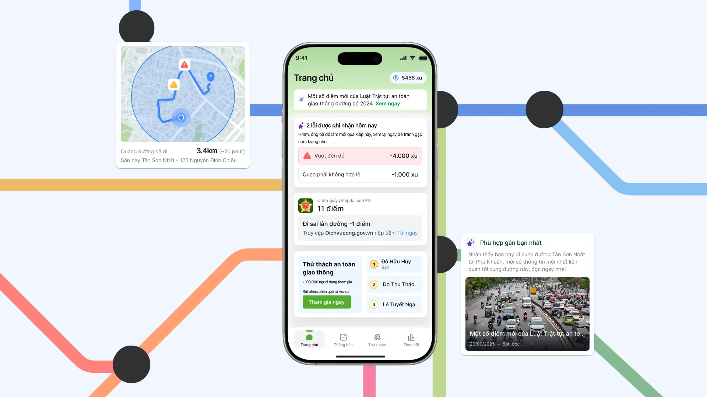
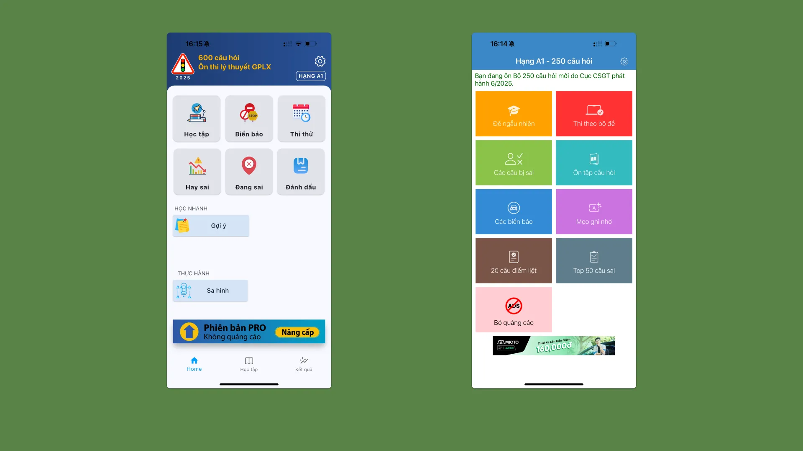
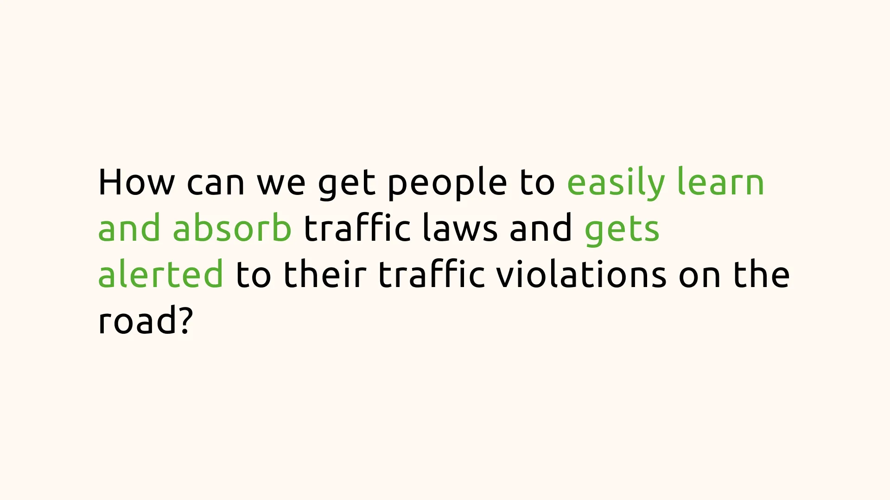

## Overview
In September 2025, I had privilege to join one of the most famous competition in Product Design field of Vietnam: Lollypop Designathon. Designathon is a unique event where teams match against each other in a 24hr race to research and deliver their solution matched with the given subject of the game.

---

## Problem Space
The daily traffics in big cities are often chaotic and unpredictable at times. There is virtually no product that can help people to know if they accidentally violate traffic regulations on the road. And for sure none wants to read those long boring news about updated traffic rules either.

This is also becoming a heavy burden on the government too. The government imposed stricter laws, hoping them will curb the traffic violation cases, but in turns created reinforcement loop for both of the parties.

---

## Tackling the Problem
This problem provided a huge opportunity to learn more about the huge gap between Vietnam's traffic regulations and its actual application to real life. And that's what we wanted to solve for.

---

## Research

