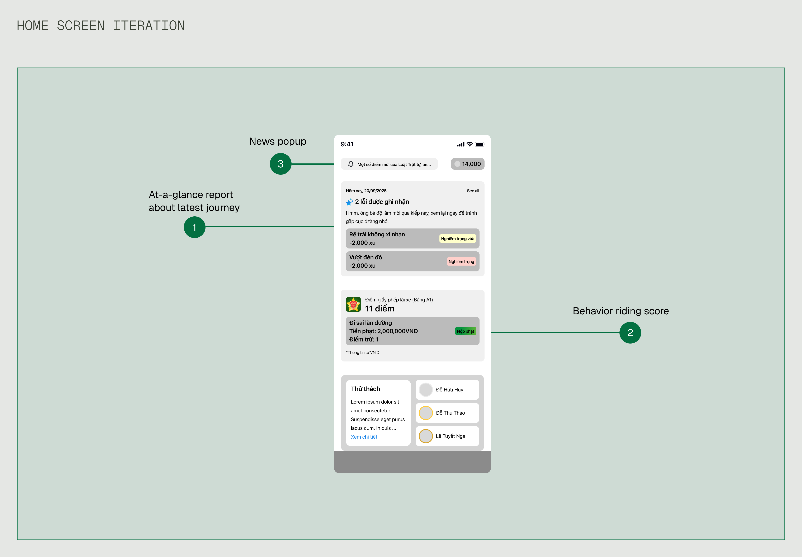
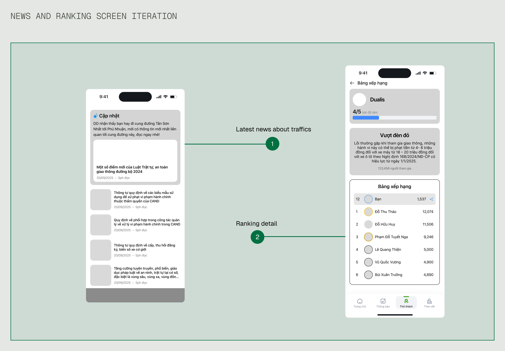

## Overview

In September 2025, I had privilege to join one of the most famous competitions in Product Design field of Vietnam: Lollypop Designathon. This is a unique event where teams match against each other in a 24hr race to research and deliver their solution matched with the given subject of the game.
## Problem Space

None of us wants to make mistake when we are riding motorbikes on the road. If we accidentally do and got caught, that means we will get fined heavily, our driver license might get revoked or worse, our motorbike will be temporarily held by the police.

However, most young people have trouble when navigating in the traffic. It's not because they don't care about the road laws, it's that those laws are so confusing and hard to remember for most of them that for them, every time they get on the road is like a losing battle.

The government imposed stricter laws, hoping they will reduce the number of traffic violation cases, which in fact can make the issue even worse. Because when riders feel cornered and overwhelmed, some of them will switch to "defensive" stance, tuning out the rules entirely rather than following them genuinely.

Solutions were made to address this, however, most solutions fell short since they only provide on what laws there when we go on the road, and not the core issue of the problem: helping them understand those laws easily and know how to follow them.

## Tackling the Problem
This problem provided a huge opportunity to learn more about the huge gap between Vietnam's traffic regulations and its actual application to real life. And that's what we wanted to solve for.

## My Individual Contribution

I led my team in planning and executing user research, ensuring that our user research is rooted in understanding user's problem. With the way I led our team’s research phase, we got a clearer picture of our waiting-to-be-solved problem at scale, and left us with deeper empathy of our user’s frustrations.

I also led my team with content design structure. Doing content design early helped us explore our design direction before investing more time in visual design, saved us significant time during the UI phase.

## User Research

My team surveyed over 50 respondents and conducted 5 interviews with high school and university students in Hanoi. We focused on how they currently learn about traffic regulations and what happens when they unknowingly break them. And these are the key insights my team and I synthesized:

The issue is clear: young people ignored learning updated traffic regulations when government announcements are boring and failed to grab attention.

## Turn insights into opportunities

Guided by user research and online survey, we turned these three key pain points: outdated knowledge, uninteresting method when teaching updated regulations and only know new laws through words of mouth--- into corresponding opportunity goals for our designs.

1. Close the knowledge gap between what young riders know and what the laws require them to do.
2. Turn driving mistakes into actionable learning opportunities both on the ride and after the ride.
3. Make learning the laws experience becoming a natural part of their journey, not something they are forced to do every day.

## Creating the goals
Based on our user research, we started to define our core **user story** to guide our work:

**As a** motorcyclist participating in the traffic.

**I need to** understand the mistakes I've made on the road without thinking about them when I'm riding.

**So I can** learn from them after each ride to become a safer rider over time.

With that said, we defined **3** core user goals for our app:
1. Stay safe and aware while on the road without distractions.
2. Understand where I got wrong without the app interfering my ride.
3. Learn about traffic laws in a way that make sense in a way for me, without feeling I have to read an university textbook.

With our user goals defined, we translated them into business goals for our app:
1. Establish our app as the go-to learning app for young riders when learning about traffic laws.
2. Drive daily usage by making learning laws a habitual part of users' riding journey.
3. Reduce the number of users violated traffic laws by improving their knowledge of the laws.

## Ideation
After we sketched our preliminary content structure, we headed to create mid-fidelity wireframes to explore our options, build our vision of our mobile app.
### Tracking Iteration
Since tracking and reporting mistakes when driving or riding on the road is our most prominent feature, we dived in it first to quickly explore potential key functions which could be highlighted. These includes: 

1. A tracking map based on user's recent journey, so they can have visual detail on how their latest journey look like.
2. A detailed report that list their riding mistakes based on the severity, so they can know which actions have biggest adverse effect to their safety and their consequences. 

### Home screen

We listed the order of information with the latest report coming from recent analysis, a behavior score about user's license and last but not least, the up-to-dated news about the traffics popping up as a toast on the screen. 

Quick report card being the most prominent so they can serve as a glance overview for users who want to know just enough what their mistakes are before opening the report to dive deep into detail. 

The behavior score is also one of the main focuses on the home screen. Our users are now increasingly concerned about their score on their license and how it impacts their licensing status, so we decided to display it right below the report where users could reference it alongside the report. 

### News and Challenge screen iteration

Instead of using AI for generative purpose, we designed it to identify behavioral patterns. The AI learns to recognize patterns like the road user usually travel or the times when they are often on the road. Using these data, it will display relevant news like recent traffic laws changes or safety cautions at the top of screen as a card, so user can know and prepare ahead of time before going on a next trip.

We also decided to make their journey a challenge itself. Every time the user completed their journey on the road without violating a mistake, they will get a point. The more points they get, the higher their ranking. They can use the points as the app's exclusive currency to buy "badges", which they can display on their account and sharing them.

## Assumptions & Constraints
Given the hackathon timeline, we focused on designing the mobile experience and assumed certain technical capabilities would exist. In a real-world scenario, these would require significant research and validation:
### Hardware Dependency
Our solution assumed a specialized camera exists and is affordable/accessible to our target users. We did not validate market readiness and manufacturing feasibility.
### Camera Accuracy
We assumed AI could reliably analyze dash cam footage to identify traffic violations. The actual accuracy rate, edge cases, and training data requirements were outside our scope.
### Privacy and Data Security
We did not design for data storage, user consent flows, or privacy policies. Privacy is a huge concern for real users when they interact with hardware that are capable of recording video footage, which would be critical for real implementation given the sensitive nature of location and video data.
### Safety Concerns
Phone vibrations while riding may be distracting. Real-world testing would be needed to determine how much frequency, intensity, and alert method is needed to alert riders without endangering them.

## Design Solution
Before heading out, the users only have to wear a specialized motorcycle helmet that's equipped a **small camera**. The camera is configured to **automatically record and send data** with wi-fi signals to **mobile app**. When the user finished their journey and their phone is connected to Internet, the app **pushes** those data to AI so the AI can **analyze** the user's journey and **produce** the analysis after an amount of time.

For the alarm part, the app will use phone's **available GPS** sensors. It will receive the offline data of the current road the user is on, send **vibrating** signals to alert them if they **accidentally violated** the traffic regulations like **exceeded** the speed limit.

## Final Design
With the wireframes and low-fidelity mock-ups established, we transitioned to next phase to create high-fidelity mocks.


  
  


## Outcome
We had the once-in-a-lifetime opportunity to share the work we done with other designers in Ho Chi Minh City. Sadly we didn't gain any honorary reward at all but the senior designers gave us a lot of valuable feedback. I had the chance to demonstrate our work on the stage with hundreds of people watching our work unfold.

## What I learned
### Early validation matters - especially for hardware dependencies
Can our users afford it? How should we integrate our camera hardware into their daily life? Who will manufacture it? How should we market it and present it not only for our users but also for those who want to invest in it? For something that is as critical as hardware, early validation like cost interview, value preposition and market research should come before interface design - not after. 
### Design for failures, not just when it works
We designed screens showing "AI analysis results" without taking into consideration what happens when AI fails - misidentified a violation, extreme weather, poor lightning conditions like roads without lights at night. Real products need designed states for uncertainty, not just success cases.
### Privacy as priority, not an afterthought
Recording users' driving journeys with cameras felt like an obvious solution to our problem. Only after we presented our solution did we realize that trust can only be earned when we place the choice and control onto our users. Optional data collection, data deletion option, and consent flows are all equally important for the whole customer's journey. 