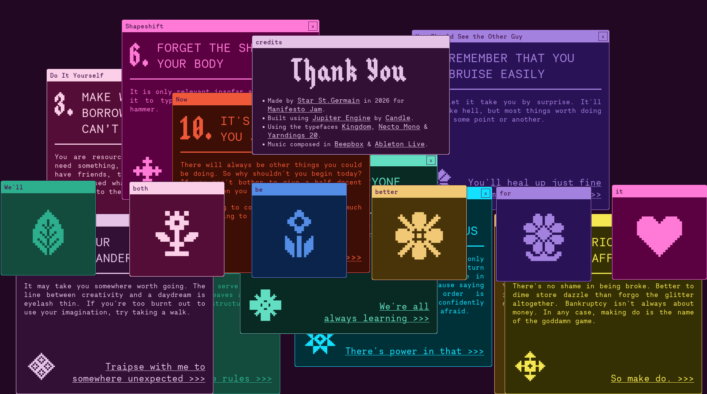

> Don't let it take you by surprise. It'll feel like hell, but most things worth doing will at some point or another. 

> You are resourceful, are you not? If you need something, ask for it. If you don't have friends, try asking strangers. You'd be surprised what can come from sending a message into the ether. Beg if you must. 

The desire to create can feel like being more inferior to the desire of destroying. But fear not, this little interactive guide will tell you "destroying" is also as good as "creating", 

