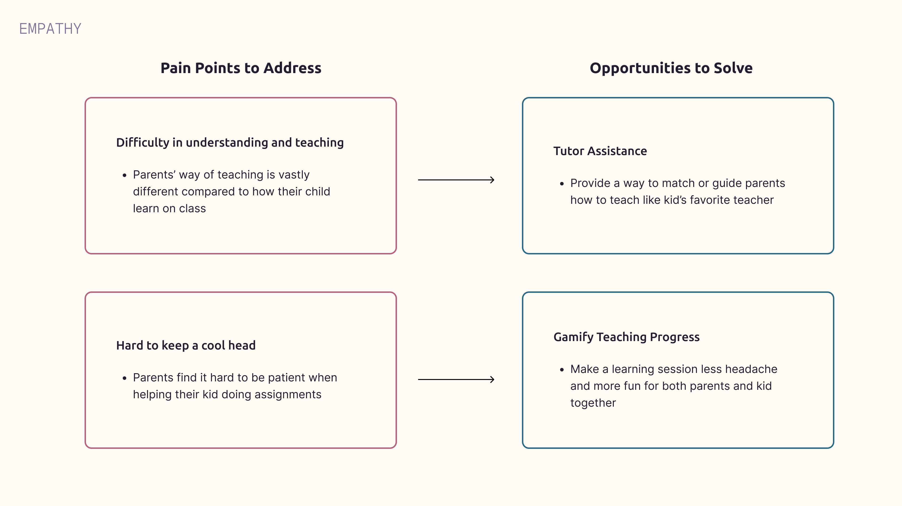
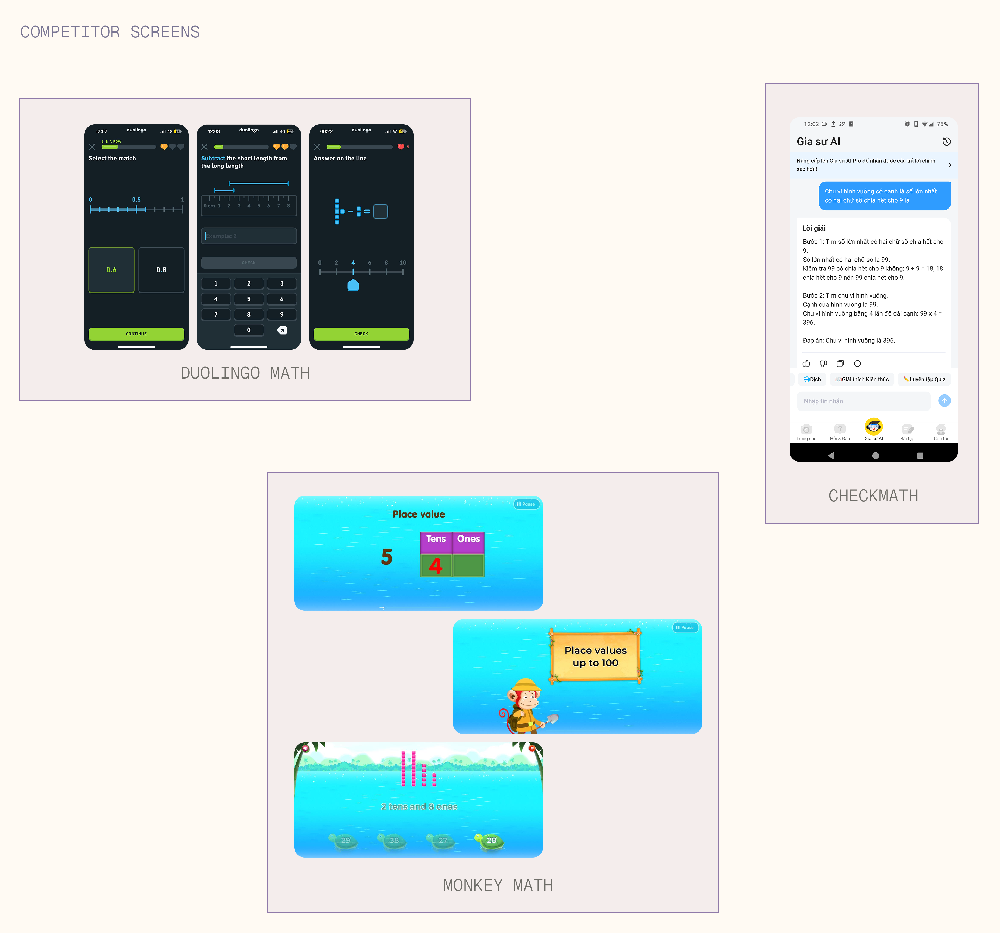

## About the project

Petfren is a mobile app designed to help parents teaching Mathematics subject to their kids in a way that's more enjoyable when learning together. Collaborating with 2 more experienced UX/UI designers and guided by my UX mentor, this project marks my very first UX project and venture beyond design. 

## The problem

Teaching kids any study material is an arduous task that some parents dread thinking about. They find it impossible to make their children to understand the importance of learning, especially Maths, when the parents also have many many other things to stress over with. Having seen those cases are happening too often, we set out a goal to address the issue at hand: **How can we design a product that can remove some of the stress of teaching Maths subject for parents?**

## Design Research
#### How are parents teaching their children right now?
We wanted to gain a better understanding of how parents navigate teaching Math to their kids. After some rounds of conducting desk research and interviewing parents, we identified a few common **patterns**:

With our in-depth analysis using Jobs-to-be-done framework, we **pinpointed** one main persona that's **best represented** our target audience pain points, needs and goals:

After gathering our interview data and notable recurrent patterns, we gained better comprehension of the problems those interviewed parents are facing and quickly set **2** main opportunity areas to focus on:

## Becoming my users

To truly understand our users, I spent an afternoon teaching Math to our mentor's 8-year-old son. Within 15 minutes, I realized why parents find this overwhelming: explaining _why_ 3 × 2 = 6 (and not 5) requires breaking down concepts I'd taken for granted. The experience was humbling and gave me deep appreciation for parents who do this daily while juggling work and household responsibilities.
## Competitor Audit
We analyzed leading math tutoring apps to identify opportunity gaps: **Monkey Math**, **Checkmath**, and **Duolingo Math**.

What they did well:
- Monkey Math provides instant fun and engaging visuals to kids ✅
- Checkmath provides instant answers so parents know the correct answer readily on hand ✅
- Duolingo Math offers game-like interfaces for children to practice doing questions ✅

However, they still failed to accomplish these areas:
- Checkmath shows step-to-step solution but it doesn’t _coach_ parents _how to teach_ the concept. One mother told us: “Sometimes I just throw the phone showing the solution to my son. I just too tired to figure how to reteach it back to him” ❌
- All apps are designed for solo student use. There is little interactivity for both parents and children to learn together, which is how elementary math is typically taught at home ❌
## Ideation
We hosted a small brainstorm with our recruited peers who is interested in education or have knowledge in teaching children. After that, we began to vote the feature which had the most "likes" and analyse their effort and impact on users with impact - effort metrix.

## Final Designs
### How might we provide a better way to teach Maths that the child can understand in a reasonably short time?
We started to explore by designing a better structured and more emphasis on creating visuals tailored to math-related questions, especially ones involving shapes or images.

### What if our AI stuck at some problems?
We found that some parents might have hesitation when asking to AI so we also provided a way to have a chat or call directly to one of many Math tutors. After all there should be multiple options to find and solve math answers for any situation.

### What if during the time of learning, the mother and her child got into a conflict?
While these are the most interesting and "weird" option, unfortunately we couldn't do user testing to gather feedback to see if our recreational feature is useful or warrant enough attention for our users to try. With enough data and testing, we might decide to potentially explore this option further.

## Reflections
### We were designing for two users simultaneously
We initially focused on the parent experience - dashboard, AI responses, progress tracking. But Petfren isn't a solo app; it's a tool for a parent-child teaching moment happening in real-time. This meant every feature needed to work for two people with different needs: the parent needs guidance and answers, while the child needs visual, engaging explanations. We learned to design for the interaction *between* them, not just for individual users.
### Testing with actual families would have changed everything
We never observed families actually using our app together. Would parents interrupt teaching to consult the app? Would kids engage with AI-generated visuals? Would the backup human tutor feature create dependency? In a real product, these questions would require in-home testing sessions to validate our assumptions before launch.
### My first UX project taught me to embrace ambiguity
Coming in as the youngest team member on my first UX project, I expected clear answers and linear progress. Instead, I learned that good design requires making decisions with incomplete information, iterating based on feedback, and being comfortable with "we don't know yet." The frameworks gave structure, but the real learning came from navigating uncertainty.
