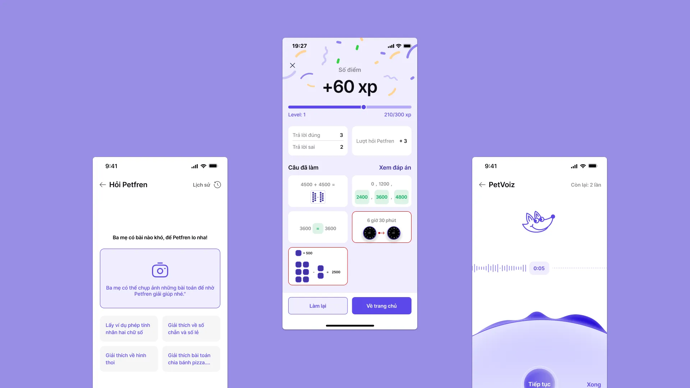
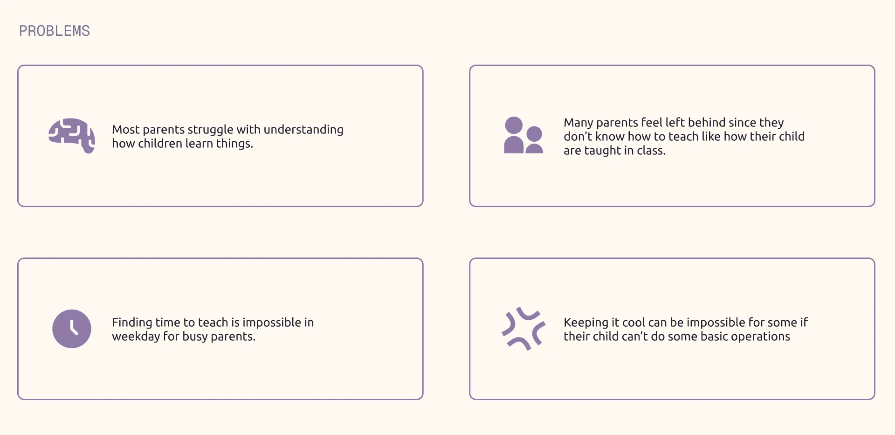
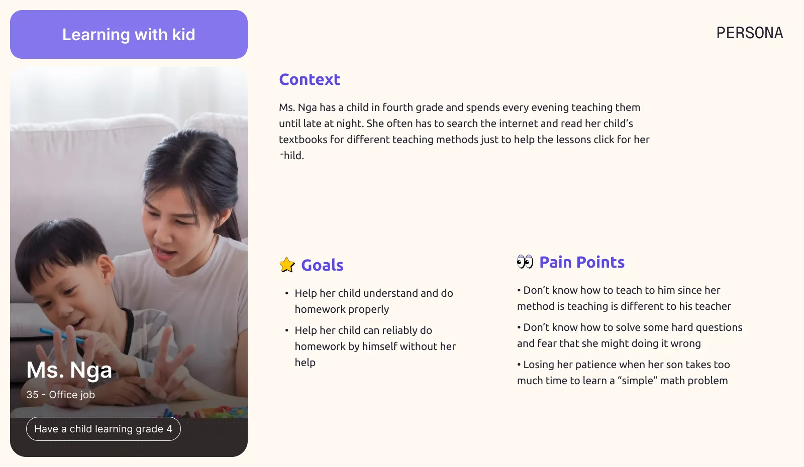
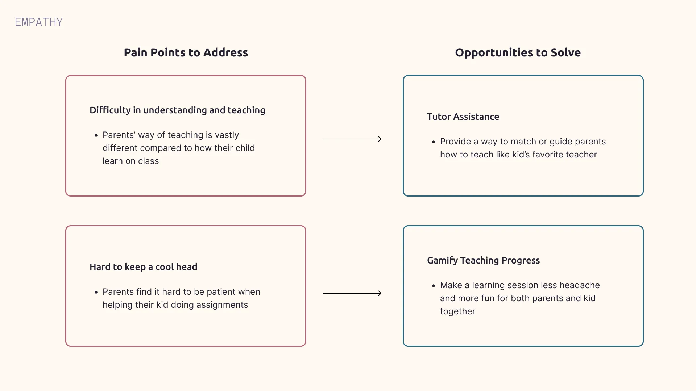
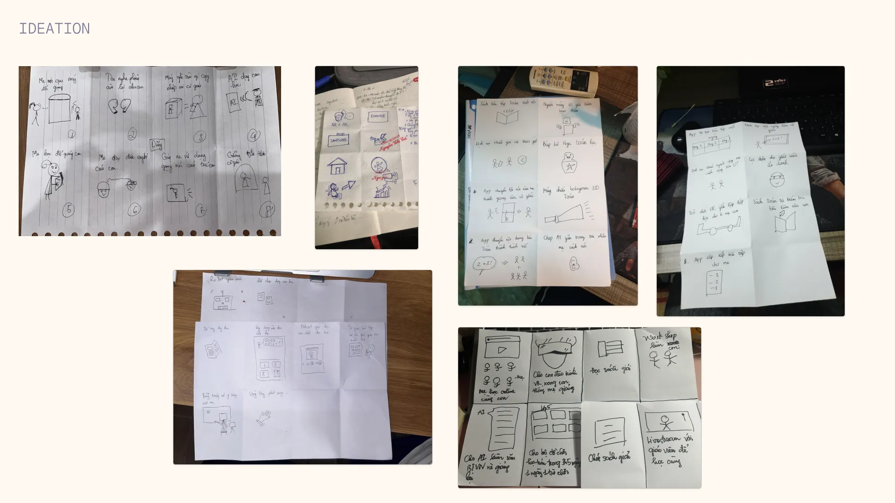
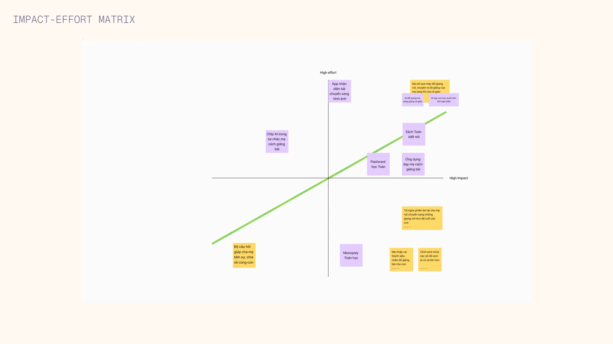
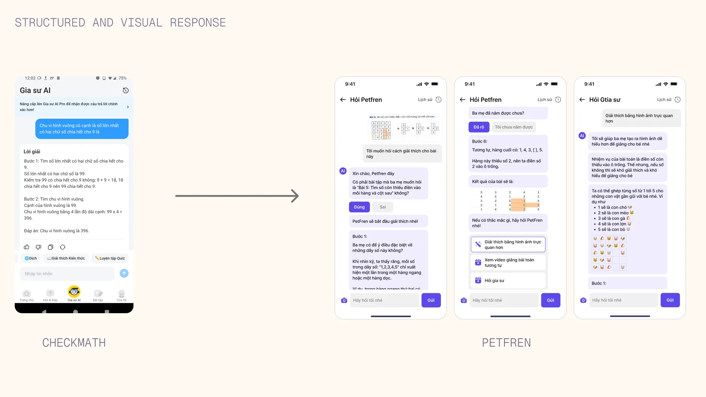
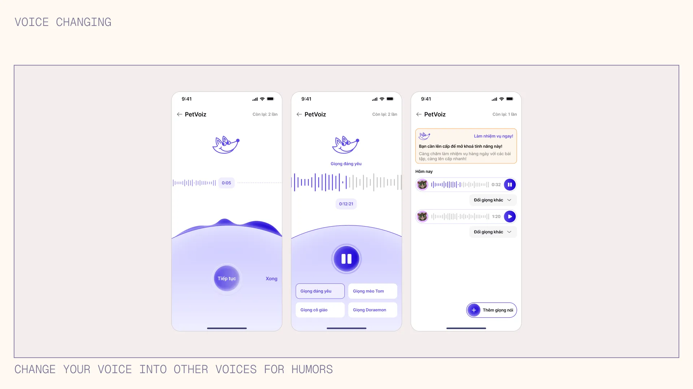
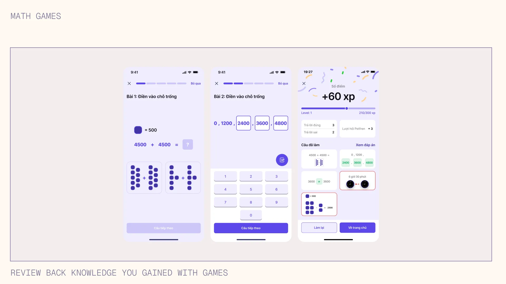



## Context
Petfren is a mobile app designed to help parents teaching Mathematics subject to their kids in a way that's more fun when learning together. Collaborating with 2 more experienced UX/UI designer with the guidance from my UX mentor, this project marks my very first UX project and venture beyond design. 

## The problem
Teaching kids any study material is an arduous task that some parents are dreaded to even think about. They feel impossible to make their children to understand the importance of learning, especially Maths, when the parents also have many many other things to stress over with. Having seen those cases are happening too often, we set out a goal to address the issue at hand: **How can we design a product that can remove some of the stress of teaching Maths subject for parents?**

## Design Research
#### How are parents teaching their children right now?
We wanted to gain a better understanding of how parents navigate teaching Math to their kids. After some rounds of conducting desk research and interviewing parents, we identified a few common **patterns**:

With our in-depth analysis using Jobs-to-be-done framework, we **pinpointed** one main persona that's **best represented** our target audience pain points, needs and goals:

After gathering our interview data and notable recurrent patterns, we were better comprehend the problems those interviewed parents are facing and quickly set **2** main opportunity areas to focus on:

## Becoming my users
Teaching children is something completely new to me that I wasn't prepared for. Starting with a "simple" afternoon of teaching Maths to our mentor's son, we quickly found that **"damn this #@$% hard lol"**. Unfortunately the video record of that day was gone which I can't upload here so you can feel how hard to make a child understand why 3 x 2 is 6 and not 5.
## Competitor Audit
We began to analyze our both direct and indirect competitors and found them are quite capable of doing these:
 Fun and engaging visuals to kids 
 Materials follow closely to what children learning in school 
 Provide math answers to parents 

However they still failed to accomplish these areas:
 Math answers are either provided without explanation at all or too complicated explanation 
 There is little interactivity for both parents and children to learn together 

## Ideation
We hosted a small brainstorm with our recruited peers who's interested in education or have knowledge in teaching children. After that, we began to vote the feature which had the most "likes" and analyse their effort and impact on users with impact - effort metrix.

## Feature exploration
#### How might we provide a better way to teach Maths that the child can understand in a reasonably short time?
We started to explore by designing a better structured and more emphasis on creating visuals tailored to math-related questions, especially ones involving shapes or images.

#### What if our AI stuck at some problems?
We found that some parents might have hesitation when asking to AI so we also provided a way to have a chat or call directly to one of many Math tutors. After all there should be multiple options to find and solve math answers for any situation.

#### How about some games or funny things to brighten up the mood?
While these are the most interesting and "weird" option, unfortunately we couldn't do user testing to gather feedback to see if our recreational feature is useful or warrant enough attention for our users to try. With enough data and testing, we might decide to potentially explore this option further.

## Reflections
#### The design process is never a linear journey, yet I enjoy every step I took
Developing an application concept from the ground up was definitely a challenge, but the journey was what made the experience incredibly rewardingly. I've learned an unfathomable amount of UX concepts (user interview, customer journey map, etc) which I couldn't ask for a better experience and the value of design as a mean for creating human good.

#### If I had more time
If time allowed, I would like to conduct user testing to see how our product behave in the real world, which would enable us to gather real analytic data about how they use it, how they feel and what their feedback will be. This will help us to have real insights that will guide design adjustment to better suit user needs and enhance their experience. 

## Team shoutout
Despite me being literally the second youngest student in the class, it's so incredible to partner up with two talented individuals (shoutout to **Dung** - the leader of our team and **Thuy** - the sister who keep our alignment going in all of our late and productive, sometimes stressful nights). 

