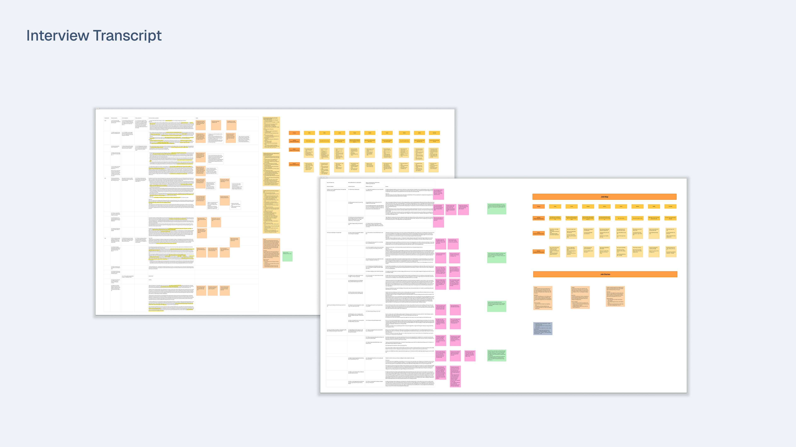
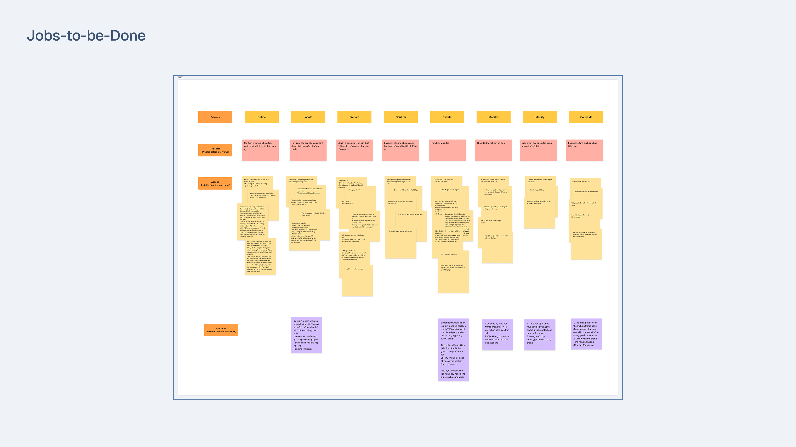
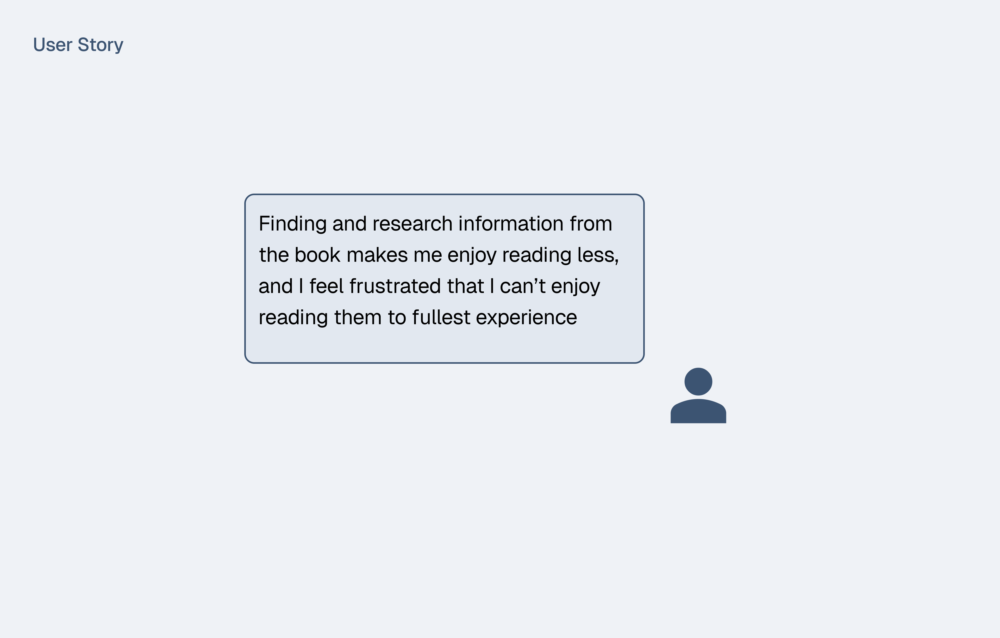
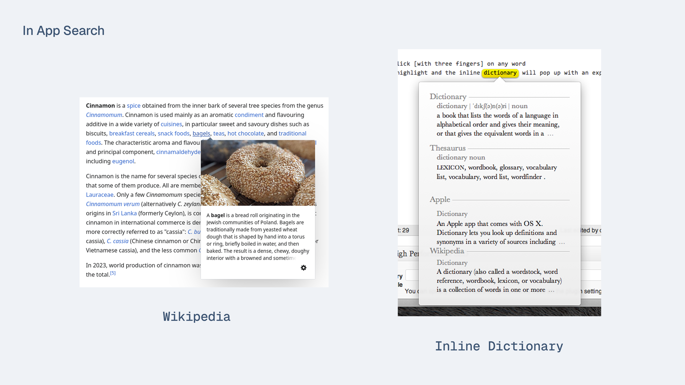
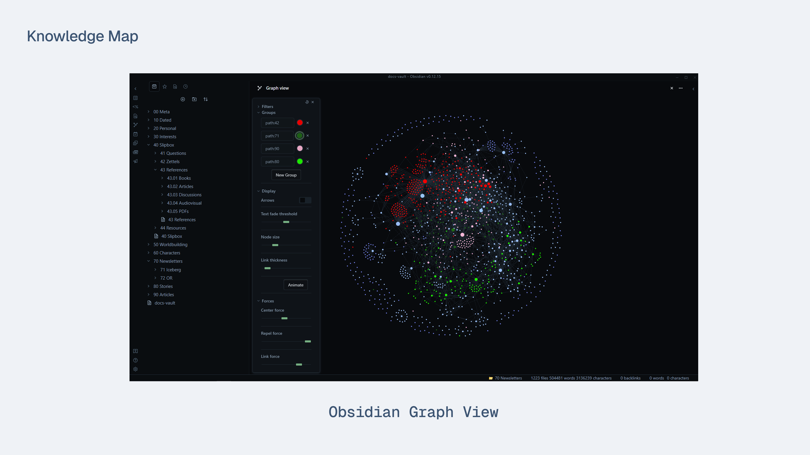
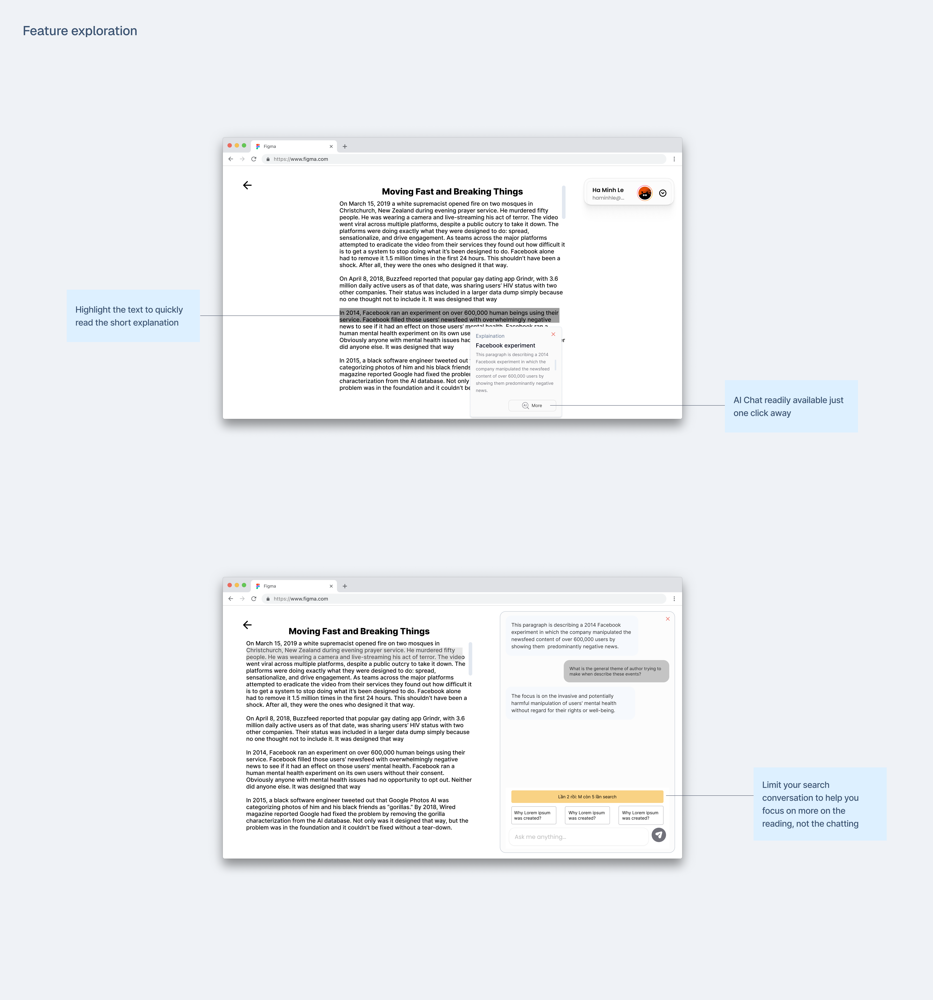

## Context

Having read some heavy research material and came across some difficult topics when I'm reading books, I know that the act to thoroughly understand them in a short time is tough. And then when I decided to look up the words or the knowledge said in the books, I realized that my motivation to finish reading them waned and it's very difficult to focus back to the reading itself.

## The Approach

We utilized the Double Diamond framework to maintain a holistic view of the project. By balancing how we expanding and narrowing down our ways of thinking, we systematically having a big picture view while pinning the right problem and solution. This approach ensured our final solution was both deeply researched and highly effective.

## Product Discovery

After receiving a big challenge about **reading habits**, we started to break down the problem into smaller pieces, focusing on the readers' experience when reading new materials.
### User Interviews

Before doing any user interviews, we started first and foremost the important activity: forming research questions. Research questions help us plan the right scope for our interviewing questions, and they also help us understand the world where our interviewees inhabits (their background, their situation, their mental model). Here are some research questions we made before conducting interviews:

1. How is their reading habits right now?
2. What motivates them to read?
3. Why do they want to continue reading? 
4. What benefits does reading provide to them?
5. What are the challenges to their reading habits right now?
6. Do they use any tools or methods to overcome them? If yes, how are they using them and how effective are those tools? If no, why?

 After recruiting, we found 10 potential interviewees. These 10 interviewees shared their story about their reading sessions and we found these common themes about their problems when reading:

1. Complex materials (like Humanities, Philosophy books, researching papers) discourage them from reading more due to they often require readers have some beforehand knowledge before reading.
2. Took too much time researching the books (reading social media's reviews, reading Readwise reviews, suggestions from friends) and when reading them they lost all the strength. 
3. They found that the reading materials were not matched to their expectations (knowledge, the author's point of view compared to them) and feel like they wasting time reading them.

  

### Analyze user's action

 To better understand and determine which problem is more valuable to solve, we decided to use the good old Job Map with Grounded Theory. This approach helped us analyze deeper about their particular actions around their reading session, understand the appropriate context and situation where they took action.

Throughout our intensive  and empathy collaboration session, we found that many of our interviewees are having uncomfortable struggles in their **Execute** job phase: 

1. Getting distracted by outside interferences (phone notification that they can't turn off due to emergency related, social media being addictive).
2. Slow reading a book with heavy subject or a book that has above **300+** pages proved to be quite daunting for them to finish (especially if the book features some hard concepts to understand instantly).
3. Wanting to acquire information from book, but failure to do so because they both want to read and apply said knowledge into their work right away to improve their productivity.
 
 
 
## Choose the right problem to solve

With so many problems to solve and all of them are legitimate problems for our users, how do we decide which one is the problem worth solving for our users and for our solution? After many rounds of heated but passionate discussions, we decided upon the final verdict:

### Spending too much time on learning and researching new knowledge from the reading material demotivate reader to continue reading them.

The reason we chose that user story is because of these 3 main supporting points:

1. This is the commonest theme we found among our participants. 7 out of 10 participants we interviewed shared this frustration.
2. There are many methods to help readers choosing the right book for them or monitor the reading habit, but very few tried to tackle the issue stems during reading.
3. The feeling of being demotivated when reading a heavy subject material resonated hard with us, which caused poor knowledge retention and loss of healthy reading experience.

## Creating product's goals

After aligning on the problem to solve, we began to draft our user's goals and our product's goals:

### User's goals:

1. Sustain their motivation to finish reading when they have to pause to research.
2. Able to achieve sufficient understanding of new concepts introduced in the reading material .
3. Able to retain and remember the context about the narrative and overall structure after pausing to research unfamiliar concepts.

### Our product's goals:

1. Help readers sustain motivation to finish reading by reducing the friction of research interruptions.
2. Help reader achieve sufficient understanding of new concepts faster, without skipping the narrative.
3. Help reader maintain connection to the book's narrative and structure after pausing to research unfamiliar concepts.

## Brainstorm the Solution

This was the most exciting part of our collaboration session - we worked together to brainstorm the solution, producing some of the most original, thought-provoking ideas that I have never heard of. 

Our ideas are rooted in the same question: how can we help user to enjoy the reading experience and the research process feels rewarding, so users come back to their reading session feeling more motivated than where they left?

### Inline Quick Preview

During our brainstorming phase, we explored two interaction patterns as potential solutions: **Wikipedia quick page preview** and **inline text dictionary**. These ideas were not yet tested or validated — rather, they emerged from the team's discussion around a core hypothesis: that readers lose focus when encountering unfamiliar terms or topics, and that surfacing context inline could help.

Drawing inspiration from how **Wikipedia** or **Readwise** implemented this feature, we believed it could serve our users well by providing relevant context without pulling them away from the reading material.

We did identify some accessibility risks early on:

- Popups could obstruct surrounding text.
- Accessibility for screen reader would need careful consideration before carrying on this feature.

Still, these felt like solvable problems within a reasonable scope, which gave us enough confidence to carry this idea forward into the solution space.
### Knowledge Map

The knowledge map was a more ambitious idea - a way to draw connections for concepts to link with each other, forming a map to show a bird's eye view of the topic landscape.

While we found the idea was novel to help user gaining better understanding when reading, we recognized that to carry it both in design and in development would be a complex task.

Given the scope of this study, we decided to sunset the knowledge map for now and keep it as a future consideration. It remains a potential direction that's worth coming back when the immediate solution has been explored and validated.
## Competitor Research
 
 We began to research some mobile apps offer options to search for more information when reading on app and found these are quite limiting in what they offer. Some provide 15-min quick read summary of the book but some of our users mentioned that it defeated the purpose of in-depth reading, while others only provide dictionary meaning of only English language.
 
 With that in mind, we proposed a concept: an AI-native web app that can read your documents when uploaded and offer instantaneous, distraction-free experience when finding information right in your reading session.

## Feature Exploration

Introducing Readmate, your reading companion always here for all your questions regrading any content in your document or your book.

A short YouTube featuring our presentation for our web app can be found right below:



## What I learned
#### Empathy with users' problems
A solution can only work if they can address the most painful problem of the users. That way a product can only truly show its value for solving the problem of the customers and bringing in value for the business.

#### Design and development always work hand in hand
By understanding how the product work through engineering architectures and business flows, I was able to make informed design decision and quickly ship the MVP for the presentation.

