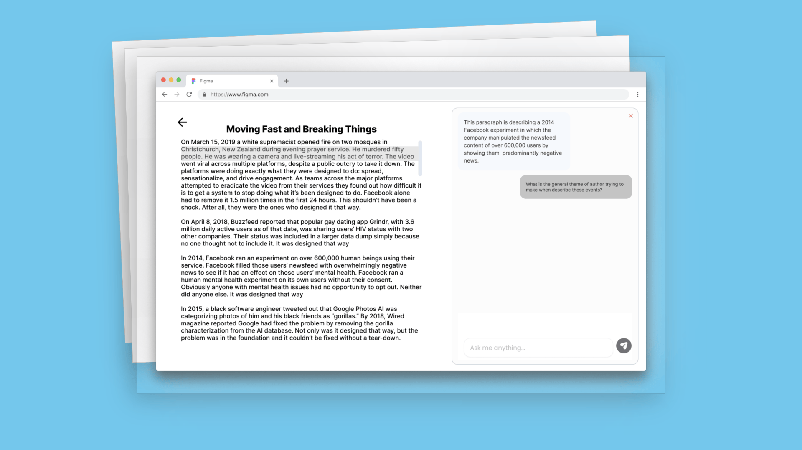
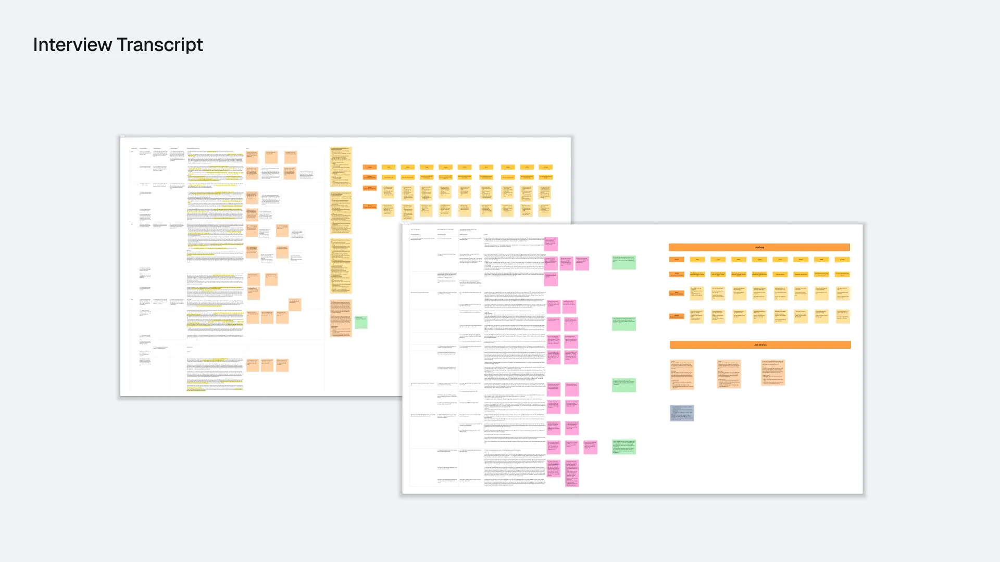
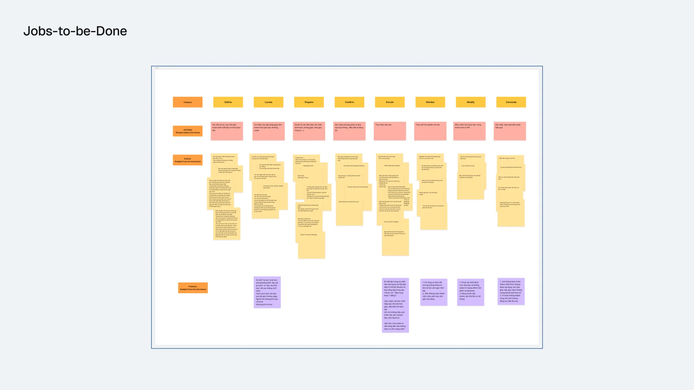
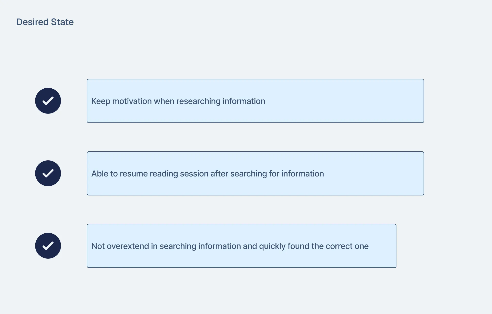
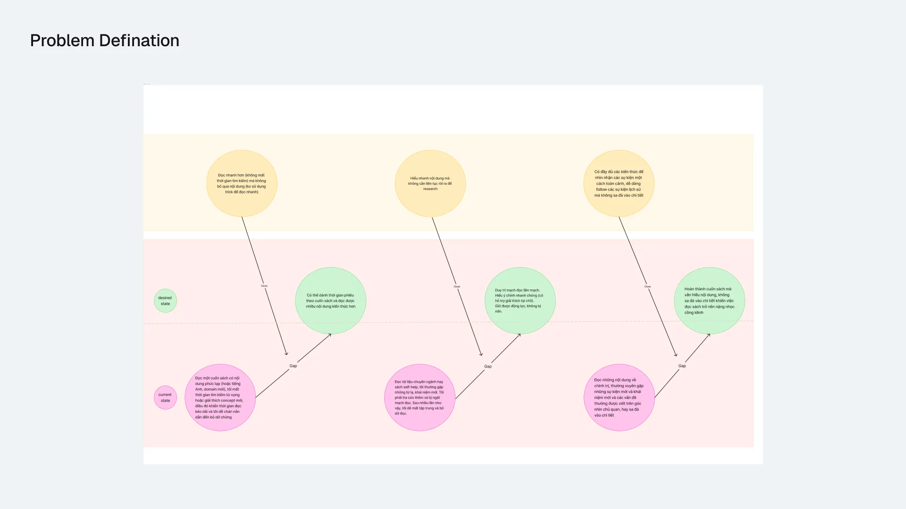
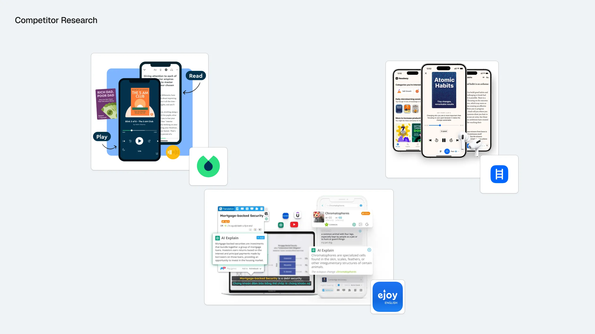
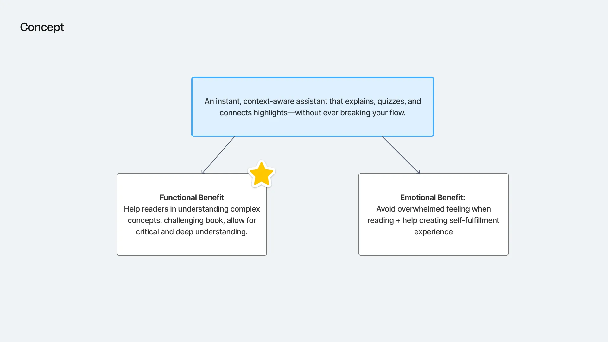


## The approach

We utilized the Double Diamond framework to maintain a holistic view of the project. By balancing divergent and convergent thinking, we systematically narrowed down the core problem while minimizing bias. This approach ensured our final solution was both deeply researched and highly effective.

## Product Discovery

After receiving a big challenge about **reading habits**, we started to break down the problem into smaller pieces, focusing on the readers' experience when reading new materials. 
#### Research questions

- How is their reading habits at the moment of interviewing right now?
- What factors might affect the reading habits?
- What are the challenges to their reading habits right now?
- Do they use any tools or methods to overcome them? If yes, how are they using them and how effective are those tools?

 After interviewing, we found 8 potential interviewees: 
  
 
 #### Jobs-to-be-Done
 The Jobs-to-be-Done framework always helps me focus on user needs independently of the solution. This approach was particularly valuable since "reading habits" is quite a broad a concept to grasp of. 
 
 
 By using this framework, we grounded our work in specific, easy to recognize actions. The brainstorm resulted in three main clearly defined "jobs" for us to prioritize:
 
 
 ## Competitor Research
 
 
 We began to research some mobile apps offer options to search for more information when reading on app and found these are quite limiting in what they offer. Some provide 15-min quick read summary of the book but some of our users mentioned that it defeated the purpose of in-depth reading, while others only provide dictionary meaning of only English language.
 
 With that in mind, we proposed a concept: an AI-native web app that can read your documents when uploaded and offer instantaneous, distraction-free experience when finding information right in your reading session.
 

## Feature Exploration
Introducing Readmate, your reading companion always here for all your questions regrading any content in your document or your book.

A short YouTube featuring our presentation for our web app can be found right below:



## What I learned
#### Empathy with users' problems
A solution can only work if they can address the most painful problem of the users. That way a product can only truly show its value for solving the problem of the customers and bringing in value for the business.

#### Design and development always work hand in hand
By understanding how the product work through engineering architectures and business flows, I was able to make informed design decision and quickly ship the MVP for the presentation.

